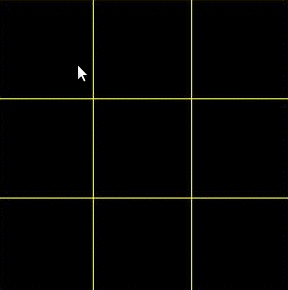

# X-O-Game
Ancient game with AI, try to defeat it

  

## Easy Run Instructions ( For non-developers )

Follow these instructions if you simply wish to run X-O Game

**Prerequisites:** 

Java VM >= 1.6 installed ( JDK 1.7 recommended)

1. Download the executable jar file to any location of your choice:

    (https://github.com/SKantar/X-O-Game/blob/master/Game.jar)

2. Run it using java:

    > java -jar Game.jar

##  Standard Run Instructions (For Developers)

Follow These instructions if you wish to run G Switch and modify the source code
as well.

**Prerequisites:**

* Java >= 1.6 ( JDK 1.7 recommended )
* Eclipse Java IDE

**Note:** X-O source code can be downloaded at: (https://github.com/SKantar/X-O-Game/tree/master/TicTacToe).

1. Download project to any location of your choice
2. After opening the project in Netbeans or Eclipse, you can easily run the project

## Commands

Run and play!
